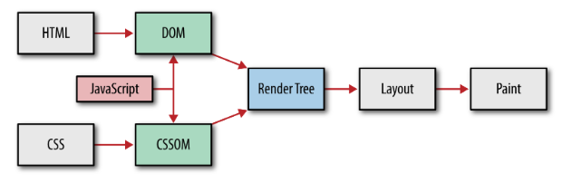
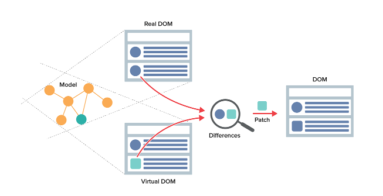
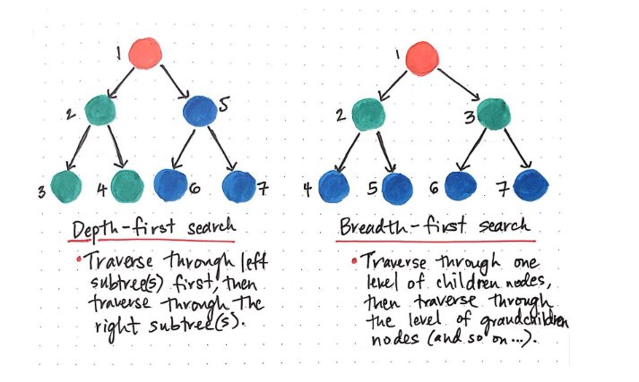
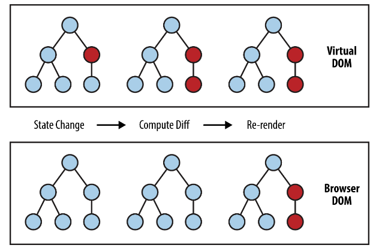
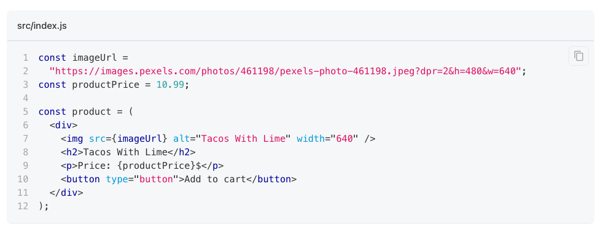
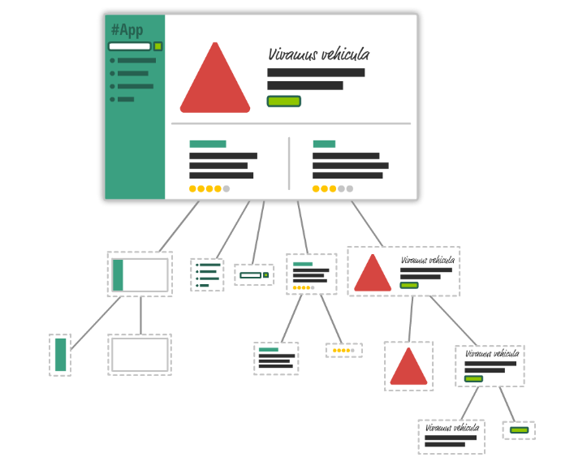
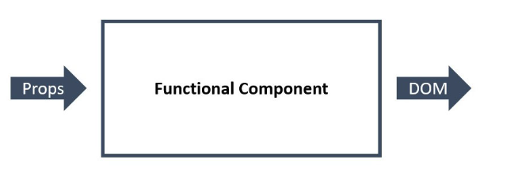

# Веб-застосунки

## Multiple-page Application

* Архітектура клієнт-сервер
* Вся логіка живе на сервері
* На кожен запит сервер надсилає готовий HTML-документ
* Перезавантаження сторінки при кожному запиті
* Погана інтерактивність
* Відмінне SEO

## Single-page Application

* Архітектура клієнт-сервер
* При завантаженні сайту сервер завжди віддає стартову HTML-сторінку `index.html`
* Кожен наступний запит на сервер отримує лише дані у JSON-форматі
* Оновлення інтерфейсу відбувається динамічно на клієнті
* Завантаження першої сторінки може бути досить повільним (лікується)
* Логіка, не пов'язана із безпекою, живе на клієнті
* Слабке SEO (лікується)
* Складність коду та його підтримки масштабується з кількістю функціоналу застосунку

# Бібліотека React

## Browser DOM і Virtual DOM

**Virtual DOM** – абстракція, легковагова копія реального DOM-дерева у вигляді JSON-документа.

* Існує тільки в пам'яті і не рендериться в браузері
* Не залежить від внутрішньої імплементації браузера
* Використовує найкращі практики оновлення реального DOM
* Збирає оновлення в групи для оптимізації рендеру (batching)

## Алгоритм оновлення DOM

# Інструменти

## Create React App

npx create-react-app ім'я_папки_проекту

# JSX

* Дозволяє використовувати XML-образний синтаксис прямо у JavaScript
* Спрощує код, робить його декларативним та читабельним
* Описує об'єкти - елементи Virtual DOM
* Це не HTML, Babel трансформує JSX у виклики функцій
* У JSX можна використовувати всі можливості JavaScript

## Рендер елементів у DOM-дерево

## Правило спільного батька

# Компоненти

## Компоненти-функції

## Властивості компонента (props)
